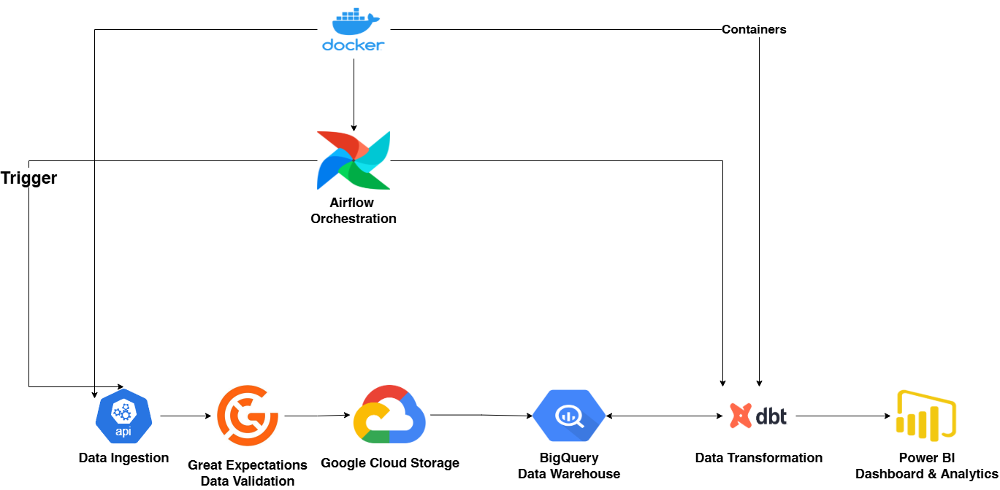

# 📊 Stock-Pipeline-DBT-Cloud

Financial analytics pipeline to track and analyze historical stock prices for the top 10 tech companies.

## TOC

* [🔍 Project Overview](#projectoverview)
* [⚙️ Stack & Technologies](#stacktechnologies)
* [🛠️ Pipeline Steps](#pipelinesteps)
* [🚀 Quick Start](#quickstart)
* [📚 Sources](#sources)

---

## <a name="projectoverview"></a>🔍 Project Overview

This is a cloud-native, end-to-end data engineering project that ingests historical stock prices from Yahoo Finance, validates and stages them in Google Cloud Storage, models and transforms them with dbt, and serves analytics via BigQuery and Power BI.
See full analysis and insights in the [Power BI dashboard README](/dashboard/README.md).

---

## <a name="stacktechnologies"></a>⚙️ Stack & Technologies

**Tools:**

* Docker & Docker Compose
* Apache Airflow (v3.0.1)
* Google Cloud Storage (GCS)
* Google BigQuery
* dbt (Core + BigQuery adapter)
* Power BI
* GitHub Actions (CI & docs)

**Libraries / Tech:**

```
yfinance        pandas       pyarrow       great_expectations  
apache-airflow  dbt-core     dbt-bigquery  google-cloud-storage  
google-cloud-bigquery  pytest    unittest    logging  
configparser    requests     psycopg2      google-oauth2-service-account
```

---

## <a name="pipelinesteps"></a>🛠️ Pipeline Steps



1. **Ingest** — Download raw OHLCV data via the `yfinance` API.
2. **Transform** — Clean and flatten using `pandas`.
3. **Validate** — Run data-quality checks with Great Expectations.
4. **Stage** — Upload validated CSV to a GCS bucket.
5. **Load** — Load staged CSV into BigQuery.
6. **Model** — Build incremental and snapshot tables with dbt in BigQuery.
7. **Automate** — Orchestrate all steps daily via an Airflow DAG, with Slack alerts on failure.

---

## <a name="quickstart"></a>🚀 Quick Start

1. **Clone the repo**

   ```bash
   git clone https://github.com/NotAbdelrahmanelsayed/stock-pipeline-dbt-cloud.git
   cd stock-pipeline-dbt-cloud
   ```

2. **Copy and edit config**

   ```bash
   mv config/configuration.example.conf config/configuration.conf
   ```

   — then open `config/configuration.conf` and fill in your GCP project, bucket and dataset names.

3. **Create and grant service account**

   * In GCP Console → IAM & Admin → Service Accounts, create one with BigQuery Admin + Storage Admin roles.
   * Download its JSON key, place it at `config/stock-pipeline-dbt-cloud.json`.

4. **Prepare environment**

   ```bash
   echo "AIRFLOW_UID=$(id -u)" > .env
   sudo chown -R $(id -u):0 .
   sudo chown -R $(id -u):0 /var/run/docker.sock
   ```

5. **Build & start services**

   ```bash
   make up-build
   ```

6. **Access Airflow UI**
   Open 👉 [http://localhost:8080](http://localhost:8080)

7. **Trigger the DAG**
   In Airflow UI, trigger `daily_stock_etl` to run the full pipeline.

8. **View dashboard**

   * Connect Power BI to your BigQuery project.
   * Open `dashboard/assets.pbix` and explore the visualizations.

---

## <a name="sources"></a>📚 Sources

- **Project Inspiration**
  - [Project 5 Idea – Data Engineering Projects Repo](https://github.com/garage-education/data-engineering-projects)

- **Stock Data with yFinance**
  - [yFinance: 10 Ways to Get Stock Data with Python](https://medium.com/@kasperjuunge/yfinance-10-ways-to-get-stock-data-with-python-6677f49e8282)

- **Apache Airflow**
  - [Creating a Minimal Airflow 3.0 Docker Compose Setup (YouTube)](https://www.youtube.com/watch?v=PbSIVDou17Q)
  - [Building a Simple Data Pipeline (Airflow Docs)](https://airflow.apache.org/docs/apache-airflow/stable/tutorial/pipeline.html)
  - [Building the Image (Airflow Docker Docs)](https://airflow.apache.org/docs/docker-stack/build.html)
  - [ShortCircuitOperator (Docs)](https://airflow.apache.org/docs/apache-airflow-providers-standard/stable/operators/python.html#shortcircuitoperator)

- **Google Cloud Storage**
  - [Uploading Objects from a File System](https://cloud.google.com/storage/docs/uploading-objects#storage-upload-object-python)
  - [Listing Buckets in a Project](https://cloud.google.com/storage/docs/listing-buckets)
  - [Creating a Bucket](https://cloud.google.com/storage/docs/creating-buckets)

- **BigQuery**
  - [Tables Intro](https://cloud.google.com/bigquery/docs/tables-intro)
  - [Datasets Intro](https://cloud.google.com/bigquery/docs/datasets-intro)
  - [Quickstart with Client Libraries](https://cloud.google.com/bigquery/docs/quickstarts/quickstart-client-libraries)
  - [DATE_ADD Function in BigQuery](https://hevodata.com/learn/date-add-bigquery/)

- **DBT + BigQuery**
  - [Quickstart Guide](https://docs.getdbt.com/guides/bigquery?step=1)
  - [BigQuery Configurations in dbt](https://docs.getdbt.com/reference/resource-configs/bigquery-configs#merge-behavior-incremental-models)
  - [Benchmarking Incremental Strategies](https://discourse.getdbt.com/t/benchmarking-incremental-strategies-on-bigquery/981)
  - [Incremental Changes with BigQuery](https://discourse.getdbt.com/t/bigquery-dbt-incremental-changes/982)
  - [dbt Course on Incremental Models](https://learn.getdbt.com/courses/incremental-models)

- **Great Expectations (GX)**
  - [Try GX Core](https://docs.greatexpectations.io/docs/core/introduction/try_gx?procedure=sample_code)
  - [Explore GX Expectations](https://greatexpectations.io/expectations/)
  - [Great Expectations Tutorial (DataCamp)](https://www.datacamp.com/tutorial/great-expectations-tutorial)
  - [Intro to Data Quality with GX (Course)](https://datacamp.com/courses/introduction-to-data-quality-with-great-expectations/)

- **Google BigQuery Python Samples**
  - [Create Dataset Sample](https://github.com/googleapis/python-bigquery/blob/main/samples/create_dataset.py)
  - [Check if Dataset Exists](https://github.com/googleapis/python-bigquery/blob/main/samples/dataset_exists.py)

- **GitHub & Actions**
  - [Using Secrets in GitHub Actions (Docs)](https://docs.github.com/en/actions/security-for-github-actions/security-guides/using-secrets-in-github-actions#creating-encrypted-secrets-for-an-environment)
  - [GitHub Actions Marketplace: Create JSON](https://github.com/marketplace/actions/create-json)
  - [GitHub Pages Action](https://github.com/marketplace/actions/github-pages-action)
  - [Checkout Action](https://github.com/marketplace/actions/checkout)
  - [Stack Overflow: GitHub Secrets in JSON](https://stackoverflow.com/questions/72177570/how-to-pass-github-secrets-as-value-in-json-file)
  - [Stack Overflow: Running Commands in Docker](https://stackoverflow.com/questions/58930529/github-action-how-do-i-run-commands-inside-a-docker-container)
  - [Stack Overflow: GitHub Pages Token Error](https://stackoverflow.com/questions/70050227/github-pages-deployment-error-you-have-to-provide-a-github-token-or-gh-pat)
  - [Stack Overflow: No Active Exception to Reraise](https://stackoverflow.com/questions/46396410/no-active-exception-to-reraise)

- **Repos**
  - [frypto](https://github.com/NotAbdelrahmanelsayed/frypto)
  - [Reddit_etl](https://github.com/NotAbdelrahmanelsayed/Reddit_ETL)