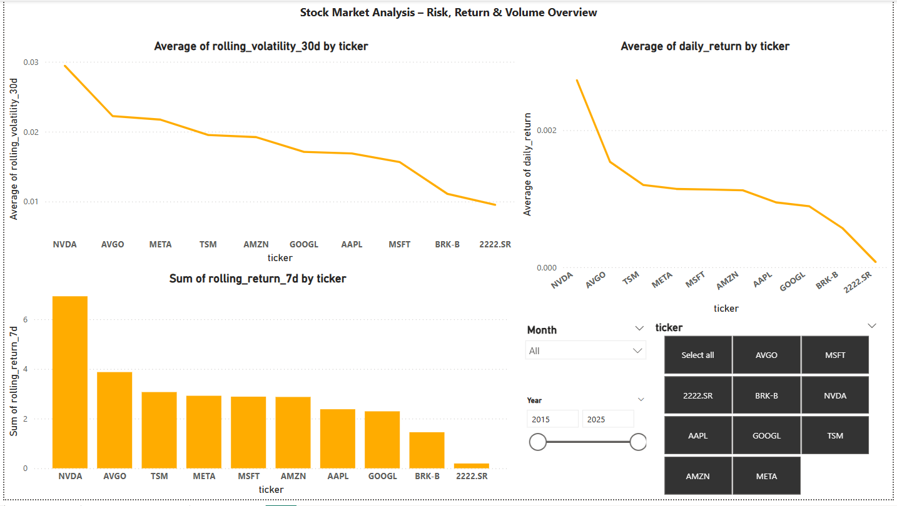
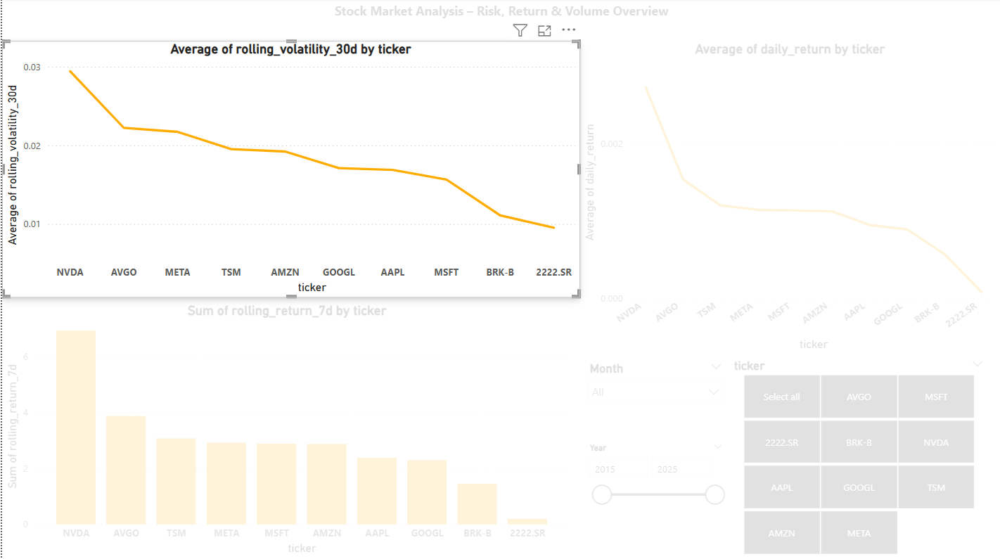
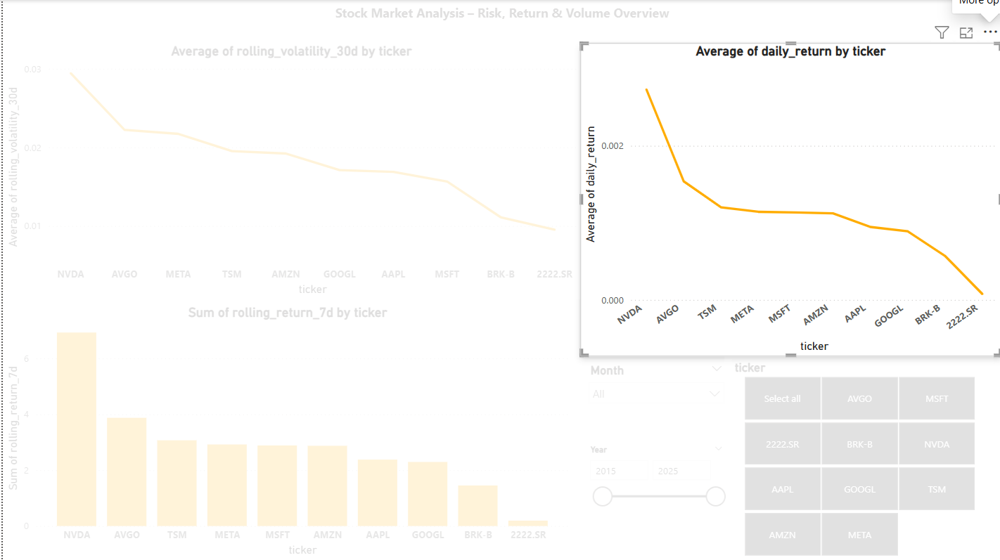
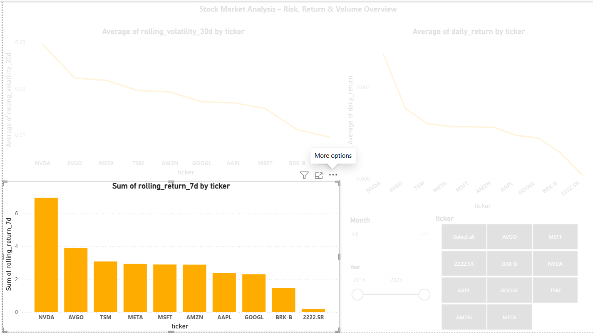

# 📈 Stock Market Analysis – Risk, Return & Volume Overview

This Power BI dashboard analyzes stock performance over the past decade across leading global companies. It evaluates return, risk (volatility), and volume activity to provide actionable insights for investors and decision-makers.

---

## 1. 📦 Project Context & Data Overview

### 🔹 The Data: What Are We Working With?

**What is stock price data?**  
Stocks are shares of ownership in a company. Their prices change as investors trade based on expectations about future value.

We work with **OHLCV data**:
- **Open**: Price at the start of the trading day  
- **High**: Highest price during the day  
- **Low**: Lowest price during the day  
- **Close**: Final price at market close  
- **Volume**: Total number of shares traded that day  

**Our tables:**

- **`raw_stock_prices`**:  
  Raw OHLCV pulled directly from `yfinance`.

- **`fact_stock_prices`**:  
  - Rolling Averages (7d, 30d): Trend smoothing  
  - Daily Price Difference: Short-term momentum  
  - Volume Rolling Sums: Capture trading surges

- **`fact_stock_returns`**:  
  - `daily_return` = (Close_t - Close_t-1) / Close_t-1  
  - `rolling_return_7d`: Average weekly return  
  - `rolling_volatility_30d`: 30-day std dev of returns (volatility)

**Why these companies?**

We included global tech & financial leaders:  
`AAPL`, `MSFT`, `AMZN`, `GOOGL`, `META`, `NVDA`, `TSMC`, `AVGO`, `BRK-B`  
And `2222.SR` (Saudi Aramco) — the world’s largest oil company, representing the Middle East.

---

### 💰 Finance Vocabulary

- **Daily Return**: % change from yesterday’s Close to today’s Close  
- **Volatility**: Std. deviation of returns (how much price jumps around)  
- **Correlation**: How two stocks move together (0 = no relation, 1 = identical)  
- **Drawdown**: % drop from peak to trough  
- **Rolling Window**: Moving average over time (e.g., 7 days)  
- **Sharpe Ratio**: Return ÷ Risk (higher = better reward for risk)  
- **Market Cap**: Total company value (Shares × Price)

---

### 📈 Business Context

In today’s volatile markets, investors need to **separate signal from noise**.  
This project transforms 10 years of daily stock data into **risk-aware insights**.

It helps:
- Identify high-performing stocks (adjusted for risk)
- Detect periods of extreme volatility and their causes
- Quantify asset relationships for diversification

🔍 We aim to answer:
- **Which stocks deliver growth and stability?**
- **Where are the hidden risks or warning signs?**
- **How can diversification reduce portfolio risk?**

---

## 📊 Dashboard Preview

### 🔹 Overview of All Metrics

---

## 🔍 Key Metrics Breakdown

### 1. 📉 Average 30-Day Rolling Volatility

Volatility measures risk — how much a stock's price fluctuates over time.

- **NVDA** has the highest volatility (highest risk).
- **2222.SR** and **BRK-B** are the most stable.
- **MSFT**, **AAPL**, and **GOOGL** lie in the middle — stable yet active.

---

### 2. 📈 Average Daily Return

This metric captures average profitability per day.

- **NVDA** outperforms all other stocks in daily return.
- **2222.SR** lags far behind with the lowest return.
- Moderate performers: **META**, **AVGO**, **MSFT**.

---

### 3. 🔄 Momentum: Sum of 7-Day Rolling Returns

This shows which stocks have had short-term growth momentum.

- **NVDA** leads again in short-term momentum.
- Other consistent players include **AVGO**, **TSM**, and **META**.

---

## ✅ Key Takeaways

- **Growth & High Risk**: `NVDA`, `AVGO`, `META`  
- **Stable & Low Risk**: `2222.SR`, `BRK-B`, `MSFT`  
- **Balanced Options**: `AAPL`, `GOOGL`, `TSM`

Diversifying between high-return and low-volatility stocks can balance portfolio performance and reduce risk exposure.